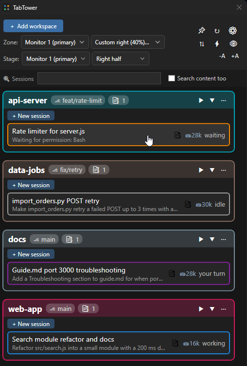
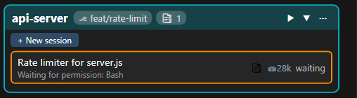
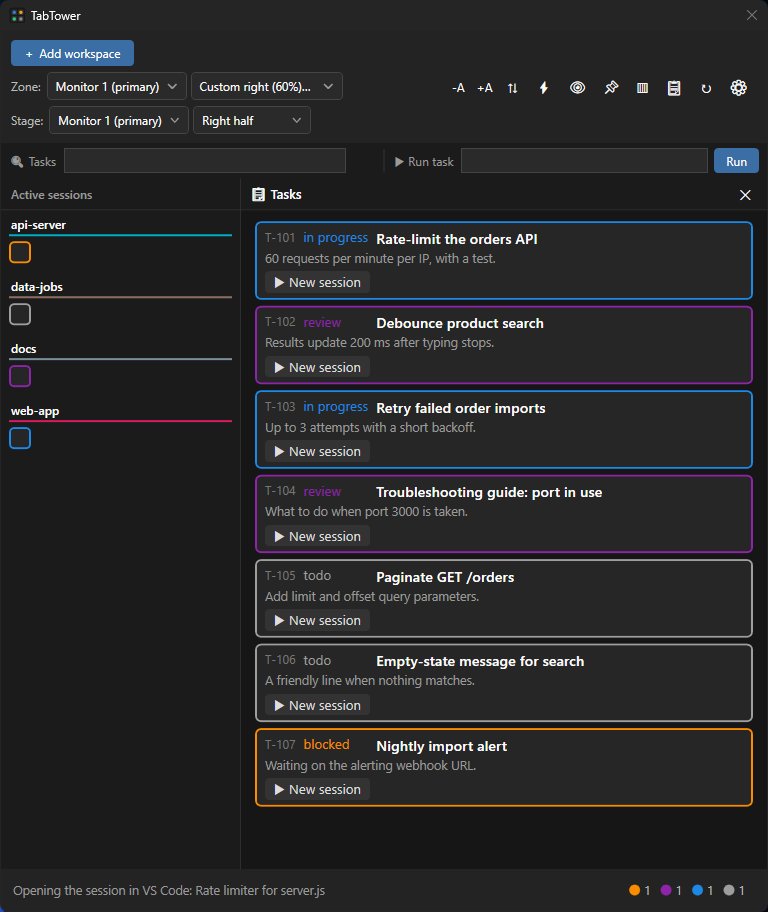

# TabTower

**A Windows control deck for your running Claude Code sessions.**

TabTower tiles every VSCode window into a live grid and shows each Claude Code session inside it as a status card — grey when idle, blue while working, blinking orange when Claude is waiting for you, purple when the turn is done, green when the session has been wrapped up for good, white when it handed off to a successor and closed itself. One click focuses the window, activates the right tab, and clears the alert.

**Built for one setup, on purpose:** Claude Code running inside **VSCode** — through its [Claude Code extension](https://marketplace.visualstudio.com/items?itemName=anthropic.claude-code) — on **Windows 10/11**. A session is a VSCode tab here, and that assumption runs through the whole tool.



> Actively developed. MIT licensed. — [latest release](https://github.com/tabtower/tabtower/releases/latest) · [changelog](CHANGELOG.md)

---

## The problem

Running one Claude Code session is easy. Running five is not — and the expensive part isn't the work, it's *noticing*. A session finishes, or stops to ask permission, and then sits there while you are heads-down in another window. The cost is the minutes between "Claude stopped" and "you looked".

TabTower turns that into a glance. A blinking orange border means *some* session needs an answer:



Click it, and the deck focuses the VSCode window, reveals that session's tab, and stops the blink. If you answer the session directly in VSCode instead, the deck notices and stops blinking on its own.

## Features

- **Live window grid** — real DWM thumbnails (`DwmRegisterThumbnail`), rendered by the Windows compositor. No screen capture, no code injection, near-zero CPU.
- **Workspace cards** — one card per VSCode workspace, showing the project name and the current git branch. Workspaces are persistent: a card survives closing the window and re-binds automatically when a matching window reappears.
- **Session cards** — one sub-card per Claude Code session, with a status-coloured border driven by Claude Code hooks (`idle` / `working` / `waiting` / `done` / `error`), plus two set from outside: `wrapped` for a session you have closed out yourself, and `replaced` for one that handed its work to a new session and was then killed — its dead tab is the only thing left, the deck has the connector close that tab for you, and the card is swept the moment the tab is gone. The status → colour/blink mapping lives in config, not in code.
- **Click to resume** — clicking a session card focuses the VSCode window, activates that session's tab (via the companion extension), and acknowledges the blink. A closed session resumes with its full history.
- **Windows notifications** — when the deck itself might be buried, a session that needs attention escalates to a native notification and a taskbar badge — and both withdraw the moment the cause is gone, including when you handle it outside the deck.
- **Reserved Zone** — TabTower can claim a quarter, half, or any custom fraction up to 90% (e.g. `2/7`) of a monitor as an AppBar, so maximized windows and snap never cover it. While zoned, the window is locked in place until the zone is turned off. To hand the deck a *whole* monitor, leave the zone off, maximize it and turn 📌 on: a reservation that leaves its monitor no work area at all is accepted by Windows and then sends the shell into a spin, so the deck will not ask for one.
- **Stage / Pin** — define a target rectangle once, then send any window to it from the UI or the CLI.
- **Full CLI** — everything is scriptable over a named pipe, with a <100ms round trip so hooks stay cheap.
- **Starts with Windows** and restores the complete layout, zone and stage.

### A tasks panel, if you want one

Point TabTower at a JSON file and it grows a read-only tasks panel: a full page listing your tasks next to your live sessions, and optionally a collapsed strip of task squares beside the deck (⚙ → *Tasks strip on the deck*, off by default). Click a task to open a session in its workspace — a new one, or a resume of a session already linked to it. The toolbar's **Run task** box does the same from a task number, without finding the card first.

If the file also describes the tree its tasks came from, the page draws a two-column grid of numbered squares down its right edge — the top level, and the selected item's children — so you can see where you are and jump anywhere in a click.



TabTower only ever reads the file, and reloads within a second of any change. The producer owns the content, the ordering and the status colours — the panel is deliberately agnostic about where your tasks come from. The full contract is behind the dialog's **📋 Copy spec** button. Leave the path empty and the feature does not exist.

### Session groups: which window a new session opens in

One folder can be open in several VSCode instances at once - each with its own
`--user-data-dir`, so each can run a separate Claude Code configuration. They share a single
card, because a card is a folder, and until now a new session went to whichever of them you
focused last: invisible, and it moves under you.

A **session group** names one of those instances and gives it a modifier. Hold it as you click
*+ New session* or a task, and the session opens in that instance every time. No modifier is a
group too, so the plain click has a fixed home rather than a guess. In the **Run task** box the
same choice is a word after the number (`4.0 green`); a group's `Aliases` add more words for it,
in any language.

Groups are config, under `SessionGroups` in `%APPDATA%\TabTower\config.json`: an id, the
modifier, a marker that appears in that instance's window titles (a coloured square in
`window.title` is ideal - one per instance, and nothing else carries it), the folder it applies
to, and optionally the script that starts that instance, which lets the deck bring it up when it
is not running. The deck runs that script rather than composing a `Code.exe` command line of its
own, because what binds a window to its Claude Code configuration is an environment variable the
launcher sets (`CLAUDE_SECURESTORAGE_CONFIG_DIR`), and a window started without it looks
identical and uses the wrong one. A group's `ConfigDir` names that folder (its last path segment,
e.g. `.claude-work`): the hook reports the folder name of every session it sees, and the deck uses
it to place each running session in its instance. `tabtower groups` prints every group with its
state. No groups are configured by default, and with none, or on a card no group names, nothing
changes.

Tasks follow the same rule: a task opens in its own folder, and a modifier picks a group only
when that folder has groups. Set `TasksFollowGroups` to `true` to aim every task at the groups
instead - the held modifier (none included) opens the task in that group's folder whatever
folder the task names, so task work always runs in the instance you chose, and Shift opens it
in the task's own folder. A group typed in the Run box always opens in that group's folder.

### Toolbar toggles

Toggles are flags for *your* processes. Each one is a toolbar button whose 1/0 state is written to a file any script can read, so you can gate a watcher, a deploy or a hook on a click. TabTower neither knows nor cares what a toggle drives.

## How it works

```
Claude Code hooks ──> tabtower-hook.ps1 ──> tabtower session status --id ... --state ...
                                                        │
                          named pipe  \\.\pipe\tabtower
                                                        ▼
VSCode windows ──DWM thumbnails──>  TabTower (WPF)  <──── VSCode extension (tab activate / tab labels)
                                                        │
                              transcript scanner (independent "waiting" detection)
```

Hooks give the leading edge — immediate and certain. But `PermissionRequest` has no matching "resolved" event, so nothing tells the deck when you *answered*. TabTower therefore also scans the session transcript for a `tool_use` with no matching `tool_result` — the only signal that sees a call finish.

Per-tool thresholds were calibrated on 11,000+ real tool calls and chosen for **false-alarm rate**, not coverage: `Read`/`Edit`/`Write` at 15s (0.04–0.12%), `Bash`/`PowerShell` at 120s (~1%), and `Agent` excluded entirely — 37% of subagent runs legitimately exceed two minutes, so no threshold there is both useful and quiet. A false alarm teaches you to ignore the deck, which costs more than a missed one. See [`hooks/README.md`](hooks/README.md) for the full table and the reasoning.

## Architecture

| Component | Role | Tech |
|---|---|---|
| UI shell | Cards grid, editing, window picker | WPF, .NET 10 |
| Thumbnail host | Live window previews | DWM Thumbnail API via `HwndHost` |
| Window tracker | Title change / create / destroy → re-bind | `SetWinEventHook` (no polling) |
| AppBar service | Reserved Zone | `SHAppBarMessage` |
| Pipe server | CLI command intake | `NamedPipeServerStream`, JSON |
| Transcript reader | Hook-independent "waiting" detection | Polls session `.jsonl` |
| Config store | Persistence | JSON in `%APPDATA%\TabTower` |

No admin rights, no injection into foreign processes, per-monitor DPI aware (v2).

The UI is English and left-to-right, but anything that comes from **outside** the app — workspace, session and task names, descriptions, tooltips, your search text, branch names — follows its own language, so Hebrew or Arabic content renders right-to-left inside an otherwise LTR window.

## Getting started

**Requirements:** Windows 10/11, and VSCode with the Claude Code extension. No .NET runtime needed — the release build is self-contained.

A note on what depends on what: the **hooks** are what colour the cards, and they work anywhere Claude Code runs — a session in a terminal will appear on the deck with a live status like any other. What needs the VSCode extension is everything that treats a session as a *tab*: revealing it on click, the live tab titles, and the auto-acknowledge when you answer a session in VSCode without touching the deck. Neither macOS nor Linux is supported, and the window layer (DWM thumbnails, the AppBar zone) is Windows-specific enough that this is unlikely to change.

1. Download `TabTower-<version>-win-x64.zip` from [Releases](https://github.com/tabtower/tabtower/releases), then unblock it **before** extracting — Windows marks downloaded files, and the mark spreads to everything you extract out of the zip:

   ```powershell
   Unblock-File .\TabTower-<version>-win-x64.zip
   ```

   Already extracted? `Get-ChildItem -Recurse | Unblock-File` inside the folder does the same.

2. Extract it anywhere and run the installer (no admin rights required — everything is per-user):

   ```powershell
   powershell -NoProfile -ExecutionPolicy Bypass -File .\install.ps1
   ```

That's it. The script installs to `%LOCALAPPDATA%\Programs\TabTower`, adds it to your user PATH, installs the VSCode extension, registers the Claude Code hooks in `~/.claude/settings.json` (after backing it up) and starts the app. It ends with a summary of the three installed versions — app, extension, hooks.

**Upgrading** = download the newer zip and run `install.ps1` again; every step is idempotent. Your settings in `%APPDATA%\TabTower` survive. Uninstall with `uninstall.ps1`.

**Coming from SessionDeck**, the project's former name? Run `install.ps1` the same way. It stops the old app, swaps its VS Code extension for the new one and replaces its Claude Code hooks; on its first start TabTower copies your cards, groups and toggles over from `%APPDATA%\SessionDeck`, which is left untouched. The installer prints the old program folder at the end so you can delete it. <!-- public-gate: allow -->


### From source

```powershell
git clone https://github.com/tabtower/tabtower.git
cd TabTower
dotnet build -c Release          # requires the .NET 10 SDK
.\bin\Release\net10.0-windows\TabTower.exe
```

The first launch starts the UI and the pipe server. Any later invocation with arguments acts as a CLI client against it.

**Wire up the hooks** — `TabTower.exe install-hooks` merges the eleven hooks into `~/.claude/settings.json`, pointing at the hook script next to the exe (backup + idempotent; `uninstall-hooks` reverts). See [`hooks/README.md`](hooks/README.md) for what each hook does. `TabTower.exe doctor` then checks that the hooks and both VS Code extensions are in place.

**Build the VSCode extension** (enables tab activation and live tab labels). The `.vsix` is not checked in:

```powershell
cd vscode-extension
npm install
npx @vscode/vsce package
code --install-extension .\tabtower-connector-*.vsix
```

## CLI

```
tabtower list [--all]                 # workspaces + sessions
tabtower add <folder path>            # add a workspace
tabtower remove <target>
tabtower set <target> [--title "..."] [--desc "..."] [--color <c>]
tabtower focus <target>               # activate the window in place
tabtower pin <target>                 # move it to the Stage, then activate
tabtower stage --monitor <n> --half left|right | --full | --rect x,y,w,h
tabtower zone  --monitor <n> --half left|right | --quarter left|right | --custom left|right [--size 2/7|40%|0.4] | --off
tabtower toggle list | get <id> | set <id> on|off
tabtower tasks [--file <path> | --off]
tabtower groups                       # the VSCode instances a new session can be aimed at
tabtower status
tabtower reconcile                    # close sessions whose tab or window is gone, now
tabtower quit                         # close the running app cleanly
tabtower install-hooks [--settings <path>] [--dry-run]   # register the Claude Code hooks
tabtower uninstall-hooks              # remove them (both run locally, no app needed)
tabtower doctor                       # check the hooks and the VS Code extensions are in place

tabtower session start  --id <session_id> --workspace <name> [--title "..."]
tabtower session status --id <session_id> --state working|waiting|done|wrapped|replaced|error|idle
tabtower session open   --id <session_id>
tabtower session end    --id <session_id>
tabtower session new    <target> [--prompt "..."] [--group <id>] [--after <sid>] [--no-focus]
tabtower session list   [--workspace <name>] [--all]
```

`<target>` is a stable numeric workspace id or `--match "<regex>"`. Exit code 0 on success, non-zero with a message on stderr otherwise.

## Known limitations

- **An inactive VSCode tab has no thumbnail.** VSCode and DWM don't render it, so session cards are text plus a coloured border. A hard platform limit, not a missing feature.
- **A minimized window freezes its thumbnail** on the last frame — keep tracked windows restored. Being covered by other windows is fine.
- Claude Code exposes no dedicated `error` hook beyond a failed turn; the `error` state exists in the model and the CLI but is mapped conservatively.
- There is no auto-update. The app shows its version in the ⚙ menu so a bug report can name one.

## Documentation

- [`CLAUDE.md`](CLAUDE.md) — how to build, test and release it, plus the settled design decisions.
- [`ARCHITECTURE.md`](ARCHITECTURE.md) — the code map: which file owns what, and what breaks when you change it.
- [`hooks/README.md`](hooks/README.md) — hook wiring and the waiting-detection heuristics.
- [`vscode-extension/README.md`](vscode-extension/README.md) — the companion extension.

## License

[MIT](LICENSE). The copyright holder is named in the license file.
